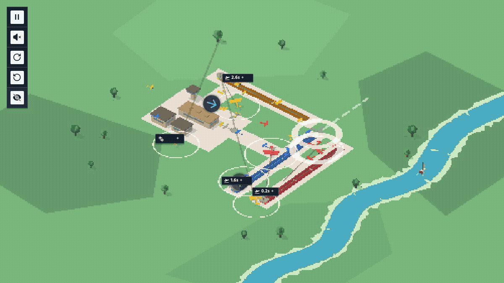

# Airport Autopilot: Receding-Horizon Control at 60 Hz

**A predictive multi-agent controller for [Airport Simulator](https://airport.apunen.com/).**



The controller above has already operated the real simulator for two accelerated
hours. The visible section is the next uninterrupted minute at true 1× speed.
Every aircraft is controlled at 60 Hz; the native scoreboard is hidden so the
traffic remains readable.

This document describes how the controller evolved, why the first architecture
was discarded, the final collision model, and the evaluator used to keep
throughput improvements from trading away safety.

## Results

| Property | Result |
| --- | ---: |
| Fixed evaluation runs | 5 × 20 simulated minutes |
| Survived | 5 / 5 |
| Mean steady-state throughput | 54.972 operations/min |
| Worst-seed throughput | 53.999 operations/min |
| Mean path inflation | 1.124× |
| Composite metric | **54.704211** |
| Longest separate validation | >5 uninterrupted simulated hours |

An operation is one landing or departure. Evaluation discards the first five
minutes of each run so the reported pace measures the saturated system rather
than the empty opening state.

## 1. Getting below the interface

The game is entirely client-side. The first useful step was not better mouse
automation; it was exposing the simulation object already driving the page.

The runner intercepts the production game bundle as Chromium loads it, attaches
the model to `window.__game`, and installs the controller around the simulation's
`step` method:

```js
const originalStep = game.step;
game.step = function stepWithController(dt) {
  control(this);
  return originalStep.call(this, dt);
};
```

This preserves the original map, aircraft specifications, spawn process,
landing rules, departure queues, renderer, and assets. It changes only how paths
are selected.

The visible browser is 1200 × 675 pixels. Simulation bounds remain locked to
the tighter quadrilateral derived from the best 138 × 138 experiment. Rendering
and traffic density are therefore independent: the game stays legible without
quietly making the control problem easier.

## 2. The first controller was too architectural

The initial version modeled runway corridors, assigned concentric holding
orbits, merged aircraft through approach gates, maintained per-plane cooldowns,
and carried separate panic and verification planners. Its planning horizon was
32 seconds.

That sounds appropriate for air-traffic control. In this simulator it created
the wrong abstraction.

Every additional mode introduced another transition: route to hold, hold to
merge, merge to runway, panic back to hold. Those transitions generated edge
cases while the long routes reduced throughput. Most importantly, the planner
was deciding *where an aircraft belonged* when the immediate safety question
was much smaller:

> Which velocity can this aircraft use now without intersecting anybody else's
> velocity over the next few seconds?

The final controller removed the holding system and reduced every frame to that
question.

## 3. Search velocities, not paths

For aircraft `i`, the direct bearing to its runway is the preferred velocity.
The controller samples 48 headings around that bearing. Candidate zero is
straight ahead; the rest alternate left and right with increasing angular
offset.

For every candidate velocity `vᵢ` and every other aircraft `j`, define relative
position and velocity:

```text
p = positionⱼ − positionᵢ
v = velocityⱼ − velocityᵢ
```

The time of closest approach inside horizon `T = 8 s` is:

```text
t* = clamp(−(p · v) / |v|², 0, T)
```

and edge-to-edge clearance is:

```text
c = |p + v t*| − radiusᵢ − radiusⱼ
```

This is a velocity-obstacle test without constructing polygonal obstacles. It
turns an entire pair of future trajectories into one scalar clearance.


This is a deterministic two-plane state running inside the production game
engine. Both aircraft use their native sprites and target the runway matching
their type. The lines are not an artist's reconstruction: the capture invokes
the production controller, rejects the unsafe direct candidate, and renders
the measured closest approach and the selected safe velocity. The choice is
recomputed on the next frame.

Candidates are ranked lexicographically in practice:

```text
safe clearance first  →  progress toward runway  →  smallest turn
```

The implementation encodes that priority as a large safety tier, then adds a
forward-progress term and subtracts turn magnitude:

```js
score = (clearance >= 2 ? 10_000 : clearance * 100)
      + 21 * cos(offset)
      - abs(turn);
```

## 4. Independent avoidance is not coordination

Selecting a safe velocity once per plane is insufficient. A later plane can
choose a velocity that invalidates an earlier plane's calculation.

The controller treats the current velocity field as a joint solution and runs
two sequential best-response sweeps. A five-seed ablation found that additional
sweeps added path churn without improving safety or throughput:

```text
initialize from current paths

repeat 2 times:
    for each flying aircraft in stable ID order:
        evaluate 48 headings against the latest field
        replace that aircraft's velocity immediately
```

Each decision becomes input to the next one. Repeating the sweep lets changes
propagate back through the field without a combinatorial joint search.


The three-plane scene uses one production-rendered aircraft of each type. Every
route is paired with its same-color runway. The independent direct field first
replays to a measured conflict. The first sequential sweep turns it into a safe
joint field; the second revisits early aircraft against the now-complete first
field. Dashed amber vectors are proposals and solid cyan or cream vectors are
accepted updates. The animation replays only recomputed, completed fields.

## 5. Aircraft that do not exist yet still matter

Incoming traffic appears first as a spawn warning containing an entry position,
heading, type, and remaining warning time. Ignoring it produces routes that are
safe now but occupied when the new aircraft materializes.

For a warning arriving after `τ` seconds, the candidate aircraft is projected to
its position at `τ`. The same closest-approach calculation then runs against the
incoming plane's known velocity over a seven-second horizon. Spawn warnings are
therefore ordinary moving obstacles shifted into the future.

Departures are included in the same velocity field at their fixed 10.5-unit
speed. Arrivals, departures, and not-yet-visible aircraft are evaluated by one
pairwise model.

## 6. Commit to a runway late

A temporary route can change on the next frame. A runway approach cannot: once
the game accepts it, landing behavior takes over and the aircraft loses freedom
to negotiate.

The controller commits to the runway only when:

```text
angular offset < 0.05 rad  AND  predicted clearance >= 2
```

Otherwise it publishes a long waypoint in the selected direction and solves
again one frame later. The apparent smoothness comes from continuous
replanning, not from long-lived routes.

## 7. Recheck the frame the simulator will actually sample

The horizon planner is sequential and uses floating-point predictions. Rarely,
the completed field can still contain a conflict at the exact next 1/60-second
sample.

The final shield projects every pair one frame forward. When clearance falls
below `0.25`, it searches 64 evenly spaced headings and replaces only the
threatened aircraft's velocity with the safest immediate alternative.


This is deliberately not another long-horizon planner. It is a narrow invariant
check over the state the simulation is about to consume. The animation is a
deterministic constructed next-tick test rendered by the production game. Its
displayed before-field, final after-field, and clearances are captured around
the complete four-pass shield—not an intermediate repair. Exactly one aircraft
changes velocity; the other retains its planned vector.

## 8. Evaluation

Visual runs helped identify failure modes but were not used to accept changes.
The fixed evaluator imports the production simulation model and runs five seeded
traffic sequences for 1,200 simulated seconds each.

If any seed crashes, the metric is zero. Otherwise:

```text
metric = 0.75 × mean throughput
       + 0.25 × worst-seed throughput
       − 0.20 × max(0, mean path inflation − 1)
```

This objective makes three trade-offs explicit:

1. Safety is a hard gate, not a weighted preference.
2. Mean throughput cannot hide one weak traffic sequence.
3. Detours are penalized only after they exceed the direct path.

An isolated autoresearch loop edits only the controller, evaluates the full
five-seed suite, commits improvements, and restores regressions. The evaluator,
game modules, prompt, dependencies, and metric remain fixed.

## Repository layout

```text
autopilot.js             controller injected before each simulation step
runner.mjs               visible production-game runner
capture-hero.mjs         two-hour warm-up + one-minute 1× hero capture
capture-explainers.mjs   staged search, coordination, and shield diagrams
start-runner.sh          persistent background launcher
status-runner.sh         runner status
stop-runner.sh           clean shutdown
```

The hero is an unmodified production-game run. The explainers use the same
client as a deterministic test renderer. Production aircraft and runway assets
stay active on a deliberately simplified dark field; the live spawn system is
paused; and the actual controller is instrumented during capture. The capture
fails if an aircraft is paired with the wrong runway, a decision replay uses a
different velocity field, a completed coordination field violates its stated
clearance, or the shield animation differs from the final velocity map.

## Run

```bash
git clone https://github.com/vreabernardo/airport-autopilot.git
cd airport-autopilot
npm install
npm run setup
npm start
```

Closing Chromium or pressing `Ctrl+C` stops the foreground runner. To keep it
alive after closing the terminal:

```bash
npm run start:background
npm run status
npm run stop
```

Configuration is environment-based:

```bash
GAME_URL=https://airport.apunen.com/ \
SOLVER_PATH=/absolute/path/to/autopilot.js \
PROFILE_DIR=/tmp/airport-profile \
VIEWPORT_WIDTH=1200 VIEWPORT_HEIGHT=675 \
npm start
```

## Rebuild the animations

The capture commands require `ffmpeg` on `PATH`, or its location in `FFMPEG`.

```bash
npm run capture:hero       # fast-forward 2 h, record the next minute at 1×
npm run capture:explainers # rebuild all three staged technical GIFs
```

The game is by [@lapunen](https://github.com/lapunen). The runner does not enter
a player name, force game over, or submit a leaderboard score.
