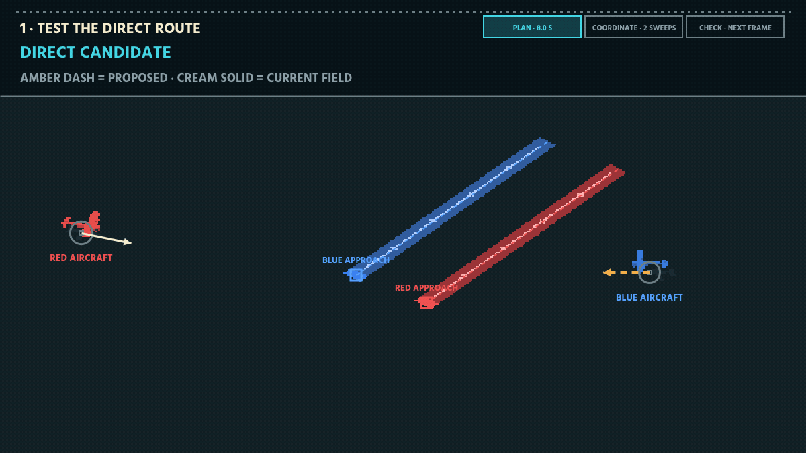
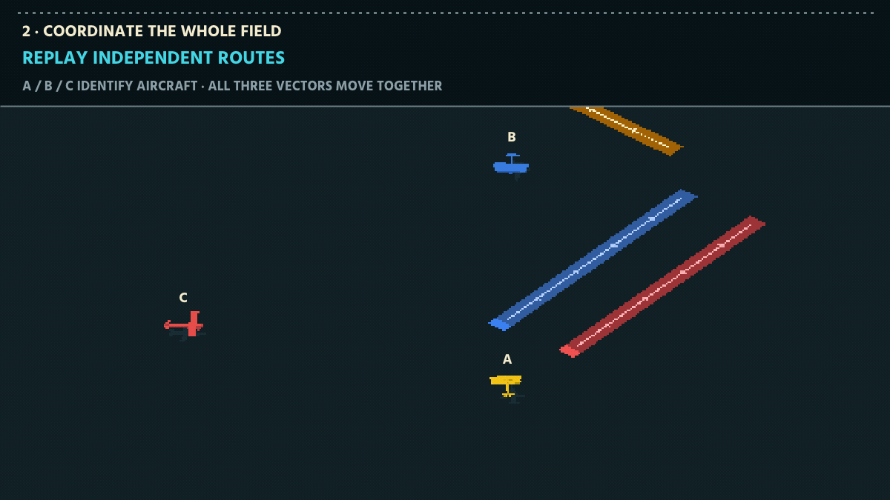
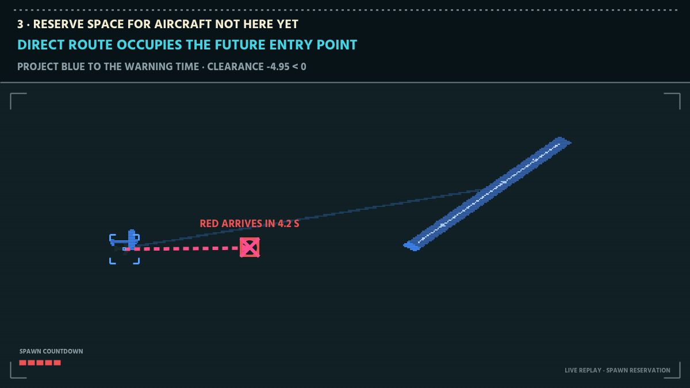
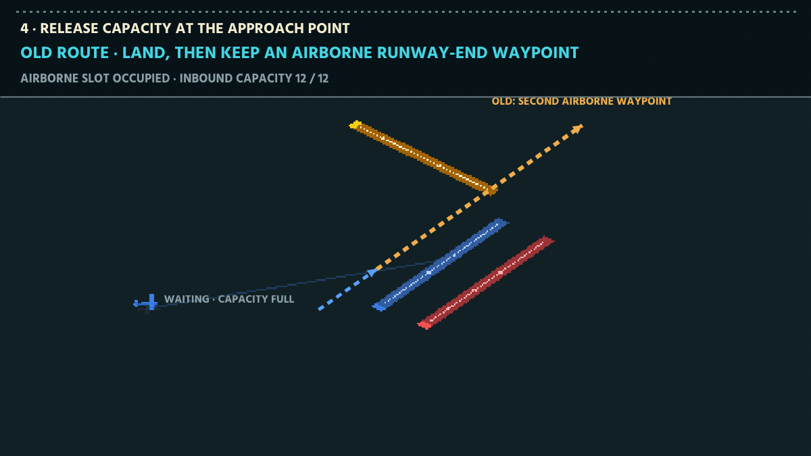
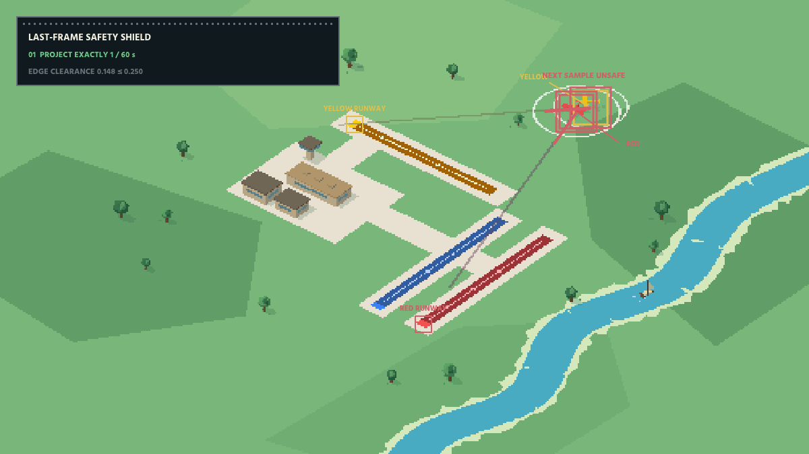

# Airport Autopilot: Receding-Horizon Control at 60 Hz

**A predictive multi-agent controller for [Airport Simulator](https://airport.apunen.com/).**


The controller above has already operated the real simulator for thirty
accelerated minutes. The visible section is the next uninterrupted three minutes
at true 1× speed—not a timelapse. The capture renders only active aircraft so
accumulated ground traffic cannot throttle the README animation; every controller
decision still runs against the complete simulation state at 60 Hz. The game's
open performance panel reports landings, departures, pace, and elapsed time live.

The panel is a cumulative, single-seed game score and is not the benchmark below.
The benchmark uses five seeds and discards each run's first five minutes. The
three-minute GIF is sustained-operation evidence; its capture-only palette and
7 fps presentation keep the complete run visible inline on GitHub. The shorter
animations below explain individual decisions.

This document describes how the controller evolved, why the first architecture
was discarded, the final collision model, and the evaluator used to keep
throughput improvements from trading away safety.

## Problem and experimental boundary

The simulator exposes one control input per flying aircraft: a path. On every
simulation tick, the aircraft steers toward the first waypoint. Supplying the
same-color runway's approach point commits a landing;
until then, the controller may replace the temporary waypoint on the next tick.

Aircraft have native speeds and collision radii in simulator world units. For
collision-eligible airborne aircraft, pairwise edge clearance at or below zero
means the physical circles touch or overlap and the run ends. Spawn warnings
announce an aircraft's future entry position, heading, type, and remaining
warning time. Departures enter the shared velocity field at a fixed 10.5-unit
speed.

The reported experiment does **not** use the model class's default 100 × 100
square bounds. It uses this fixed quadrilateral for the controller, every
ablation, and every reported seed:

```text
(-39.873, 14.341) → (-7.083, 41.777) →
(39.873, -14.341) → (7.083, -41.777)
```

Its area is 3,128.34 square world units versus 10,000 for the model's default
square. Bounds affect spawn positions, route length, and traffic pressure, so
these numbers are internally comparable but should not be compared directly with
default-window runs or leaderboard scores that use different bounds.

## Results

| Property | Result |
| --- | ---: |
| Fixed evaluation runs | 5 × 20 simulated minutes |
| Survived | 5 / 5 |
| Mean steady-state throughput | 64.745 operations/min |
| Worst-seed throughput | 64.465 operations/min |
| Mean path inflation | 1.077× |
| Composite metric | **64.660114** |

An operation is one landing or departure. Evaluation discards the first five
minutes of each run so the reported pace measures the saturated system rather
than the empty opening state. The committed [machine-readable result](evaluation/results/latest.json)
contains bundle/controller hashes, definitions, bounds, seeds, and every run.

### Ablations under identical seeds and bounds

| Controller | Survived | Mean ops/min | Composite | Shield replacements |
| --- | ---: | ---: | ---: | ---: |
| Direct approach only | 0 / 5 | — | 0 | 0 |
| One planning sweep | 5 / 5 | 63.745 | 63.494 | 10,765 |
| Two planning sweeps | 5 / 5 | 60.999 | 60.117 | 9,899 |
| Four sweeps, stable ID order | 5 / 5 | 64.012 | 63.909 | 13,235 |
| Four sweeps, uniform 12-second warning horizon | 5 / 5 | 64.065 | 63.684 | 10,926 |
| Four sweeps, full airborne runway roll | 5 / 5 | 55.386 | 55.209 | 8,798 |
| **Four sweeps, newest first, tuned horizons, threshold release** | **5 / 5** | **64.745** | **64.660** | **11,626** |

The sequential update is not a monotonic optimizer: two sweeps can settle into a
worse local field than one. Four sweeps recover the throughput and give early
decisions enough chances to react to the completed field. The remaining rows
change one final-controller choice at a time. The discarded orbit/merge
architecture predates the fixed evaluator, so claims about it remain
qualitative.

## 1. Getting below the interface

The game is entirely client-side. The first useful step was not better mouse
automation; it was exposing the simulation object already driving the page.

The runner intercepts the production game bundle as Chromium loads it, attaches
the model to `window.__game`, and installs the controller around the simulation's
`step` method:

```js
const originalStep = game.step;
game.step = function stepWithController(dt) {
  control(this);
  return originalStep.call(this, dt);
};
```

This preserves the original map, aircraft specifications, spawn process,
landing rules, departure queues, renderer, and assets. Runtime changes are
limited to path selection **and the explicitly fixed bounds above**. Hero capture
also applies rendering-only filters described at the end of this document.

The visible browser is 1200 × 675 pixels. Simulation bounds remain locked to the
quadrilateral above regardless of viewport size. This prevents a README capture
from changing the evaluated problem, but the chosen bounds are still an
experimental parameter—not a neutral rendering detail.

## 2. The first controller was too architectural

The initial version modeled runway corridors, assigned concentric holding
orbits, merged aircraft through approach gates, maintained per-plane cooldowns,
and carried separate panic and verification planners. Its planning horizon was
32 seconds.

That sounds appropriate for air-traffic control. In this simulator it created
the wrong abstraction.

Every additional mode introduced another transition: route to hold, hold to
merge, merge to runway, panic back to hold. Those transitions generated edge
cases while the long routes reduced throughput. Most importantly, the planner
was deciding *where an aircraft belonged* when the immediate safety question
was much smaller:

> Which velocity can this aircraft use now without intersecting anybody else's
> velocity over the next few seconds?

The final controller removed the holding system and reduced every frame to that
question.

## 3. Search velocities, not paths

For aircraft `i`, the direct bearing to its same-color runway **approach point**
is the preferred velocity. The controller samples 48 headings around that
bearing. Candidate zero is straight ahead; the rest alternate left and right
with increasing angular offset.

For every candidate velocity `vᵢ` and every other aircraft `j`, define relative
position and velocity:

```text
p = positionⱼ − positionᵢ
v = velocityⱼ − velocityᵢ
```

The time of closest approach inside horizon `T = 8 s` is:

```text
t* = clamp(−(p · v) / |v|², 0, T)
```

and edge-to-edge clearance is:

```text
c = |p + v t*| − radiusᵢ − radiusⱼ
```

This is a velocity-obstacle test without constructing polygonal obstacles. It
turns an entire pair of future trajectories into one scalar clearance.



This is a deterministic two-plane state running inside the production game
engine. Both aircraft use their native sprites and target the runway matching
their type. The lines are not an artist's reconstruction: the capture invokes
the production controller, rejects the unsafe direct candidate, and renders
the measured closest approach and the selected safe velocity. The choice is
recomputed on the next frame. The final phase continues the teaching replay
after the conflict clears: blue turns back to the blue approach, red keeps the
red approach, and both visibly finish on their matching runways. The detour is
one decision, not a new destination.

Candidate ranking has two layers:

```text
clearance ≥ 2 enters the safe tier
within a tier: weighted progress toward approach minus turn magnitude
```

This is not a fully lexicographic ordering: progress and turn can trade off
inside the safe tier. Unsafe candidates are graded continuously by clearance.
The implementation is:

```js
score = (clearance >= 2 ? 240 : clearance * 100)
      + 21 * cos(offset)
      - class_turn_weight * abs(turn);
```

## 4. Independent avoidance is not coordination

Selecting a safe velocity once per plane is insufficient. A later plane can
choose a velocity that invalidates an earlier plane's calculation.

The controller treats the current velocity field as a joint solution and runs
four sequential best-response sweeps. Aircraft are visited from youngest to
oldest. A new arrival therefore reserves a viable corridor before older,
already-stable traffic consumes the available choices:

```text
initialize from current paths

repeat 4 times:
    for each flying aircraft from newest to oldest:
        evaluate 48 headings against the latest field
        replace that aircraft's velocity immediately
```

Each decision becomes input to the next one. Repeating the sweep lets changes
propagate back through the field without a combinatorial joint search. In the
isolated ablation, replacing newest-first order with stable ID order lowers mean
throughput from 64.745 to 64.012 operations/min.



The three-plane scene uses one production-rendered aircraft of each type and
labels their actual planning order. The independent direct field first reaches
a measured conflict. Sweep one accepts updates immediately from newest to
oldest; sweeps two through four repeat that order against increasingly complete
fields. Dashed amber vectors are proposals and solid cyan or cream vectors are
accepted updates. The measured final field clears the conflict, then all three
aircraft continue to their same-color runways.

## 5. Aircraft that do not exist yet still matter

Incoming traffic appears first as a spawn warning containing an entry position,
heading, type, and remaining warning time. Ignoring it produces routes that are
safe now but occupied when the new aircraft materializes.

For a warning arriving after `τ` seconds, the candidate aircraft is projected to
its position at `τ`. The same closest-approach calculation then runs against the
incoming plane's known velocity. The warning horizons are 12 seconds for yellow,
14 for blue, and 9 for red; red receives an additional 0.40–0.45 second
class-dependent entry grace. The candidate horizon is capped when a direct
landing would remove the aircraft sooner.

Departures are included in the same velocity field at their fixed 10.5-unit
speed. Arrivals, departures, and not-yet-visible aircraft are evaluated by one
pairwise model.



The animation is a constructed state executed by the production controller. It
first projects blue's direct route to the exact red warning time and records a
negative clearance. The selected blue velocity clears the reserved entry point;
red then materializes using its native sprite and both aircraft finish at their
matching runways. Replacing the tuned class horizons with 12 seconds for every
class lowers the composite metric from 64.660 to 63.684.

## 6. Commit late, release at the threshold

A temporary route can change on the next frame. A runway approach cannot: once
the game accepts it, landing behavior takes over and the aircraft loses freedom
to negotiate.

The controller commits to the runway only when:

```text
angular offset < 0.05 rad  AND  predicted clearance >= 1.8
```

Otherwise it publishes a long waypoint in the selected direction and solves
again one frame later. The apparent smoothness comes from continuous
replanning, not from long-lived routes.

The implementation uses `1.8` as the final commitment threshold after the
candidate has already competed in the `2.0` safe tier. This small hysteresis
prevents a route oscillating at the boundary between temporary guidance and
landing commitment.

Once committed, the airborne route ends at the runway approach threshold. At
that point the unchanged simulator records the landing and transfers the
aircraft onto its configured ground route. The earlier controller unnecessarily
kept the runway end as a second airborne waypoint. That fixed runway roll held
one of the simulator's twelve inbound slots for another 7–9 seconds after the
landing was already inevitable.

Removing that redundant waypoint remains the largest isolated throughput gain:
the five-seed mean rises from 55.386 to 64.745 operations/min. Aircraft speeds,
scoring, collision detection, spawn timing, taxi routes, and departure
scheduling are unchanged.



The square in the animation is the simulator's actual runway approach point,
which is slightly before the painted runway texture. With the old two-waypoint
route the aircraft remains in airborne capacity until the runway-end waypoint.
With threshold release, the unchanged simulator accepts the landing at the
approach point, owns the subsequent ground movement, and admits the next arrival.

## 7. One last check before moving

Before the game moves the aircraft, the controller previews the next frame. If
two physical collision circles would be too close, it turns one aircraft
slightly, checks the preview again, and only then lets the game advance.



In the close-up, the aircraft sprites are where the planes are now and the
colored circles are where their physical boundaries will be next frame. The
first preview is too close. Yellow turns, the second preview is safe, and both
planes move. Normal routing then resumes and both land on their original
runways.

That is the entire purpose of this final check. It does not choose destinations
or replace the eight-second planner; it prevents the already chosen field from
handing an unsafe immediate step to the simulator.

### Implementation detail

The check projects every pair forward by `1/60` second. At edge clearance
`≤ 0.25`, it tests 64 evenly spaced headings and keeps the safest immediate
alternative. It makes four sequential passes because changing one aircraft also
changes what every later aircraft will see:

```text
repeat 4 times:
    for each flying aircraft:
        preview this pair one frame ahead
        if edge clearance <= 0.25:
            test 64 headings and keep the safest
```

The teaching case starts with `0.134` clearance and finishes with `0.318`. It
needs one replacement; a general frame may need more.

Across the five final evaluation runs the counter recorded 11,626 velocity
replacements over 360,005 controlled frames: 3.23 replacements per 100 frames,
or 1.94 per simulated second. The counter is per aircraft replacement, not per
unique frame, so calling shield activation “rare” would be misleading.

## 8. Evaluation

Visual runs helped identify failure modes but were not used to accept changes.
The committed evaluator imports pinned production simulation modules and runs
seeds `101–105` for 1,200 simulated seconds each. “Survived” means the model
remained in phase `playing` through 1,200 seconds; any earlier game-over is a
crash. Throughput counts landings plus departures after second 300.

Path inflation is measured once per landing:

```text
inflation = aircraft age × native speed
          / straight-line spawn-to-runway-approach distance
```

This is an internal simulator proxy rather than geographic track length. It is
reported because it uses model-native state and is reproducible for every seed.

If any seed crashes, the metric is zero. Otherwise:

```text
metric = 0.75 × mean throughput
       + 0.25 × worst-seed throughput
       − 0.20 × max(0, mean path inflation − 1)
```

This objective makes three trade-offs explicit:

1. Safety is a hard gate, not a weighted preference.
2. Mean throughput cannot hide one weak traffic sequence.
3. Detours are penalized only after they exceed the direct path.

Reproduce the complete result and ablation table with:

```bash
npm run --silent evaluate > /tmp/airport-result.json
```

The evaluator executes `autopilot.js` itself, not a second controller copy. The
result records SHA-256 identities for that file and both pinned game modules.
The isolated autoresearch loop used during development was permitted to edit
only the controller, evaluated the same full five-seed suite, committed
improvements, and restored regressions. Its minimal fixed instruction is retained
as [evaluation/autoresearch-program.md](evaluation/autoresearch-program.md).

## Repository layout

```text
autopilot.js             controller injected before each simulation step
runner.mjs               visible production-game runner
capture-hero.mjs         30-minute warm-up + three-minute fixed-step hero
capture-explainers.mjs   five controller-recorded technical animations
evaluation/evaluate.mjs  fixed five-seed evaluator and ablations
evaluation/fixed/        pinned production model/map modules
evaluation/results/      machine-readable result with hashes and per-seed rows
start-runner.sh          persistent background launcher
status-runner.sh         runner status
stop-runner.sh           clean shutdown
```

The hero is a production-engine run with capture-only rendering filters and
explicit fixed-step advancement. The full aircraft array is restored for every
60 Hz simulation step; only inactive accumulated ground aircraft are hidden while
rendering each frame. The explainers use the same client as a deterministic test
renderer. Production aircraft and runway assets stay active on a deliberately
simplified dark field; live spawning is paused; and the actual controller is
instrumented during capture. Capture fails if an aircraft is paired with the
wrong runway, a decision replay uses a different velocity field, a completed
coordination field violates its stated clearance, a spawn reservation does not
clear its warning, or the shield animation differs from the final velocity map.

## Run

```bash
git clone https://github.com/vreabernardo/airport-autopilot.git
cd airport-autopilot
npm install
npm run setup
npm start
```

Closing Chromium or pressing `Ctrl+C` stops the foreground runner. To keep it
alive after closing the terminal:

```bash
npm run start:background
npm run status
npm run stop
npm run evaluate
```

Configuration is environment-based:

```bash
GAME_URL=https://airport.apunen.com/ \
SOLVER_PATH=/absolute/path/to/autopilot.js \
PROFILE_DIR=/tmp/airport-profile \
VIEWPORT_WIDTH=1200 VIEWPORT_HEIGHT=675 \
npm start
```

## Rebuild the animations

The capture commands require `ffmpeg` on `PATH`, or its location in `FFMPEG`.

```bash
npm run capture:hero       # fast-forward 30 min, record the next 3 min at 1×
npm run capture:explainers # rebuild all five staged technical GIFs
```

Hero defaults are seed `101`, `TARGET_HOURS=0.5`, `CAPTURE_SECONDS=180`, and
`HERO_FPS=7`. The simulator and controller still execute every 1/60-second tick;
the capture distributes those 60 ticks deterministically over seven rendered
frames each second. Wall-clock browser throttling therefore cannot stretch the
displayed timeline. All four settings can be overridden through environment
variables.

The game is by [@lapunen](https://github.com/lapunen). The runner does not enter
a player name, force game over, or submit a leaderboard score.
