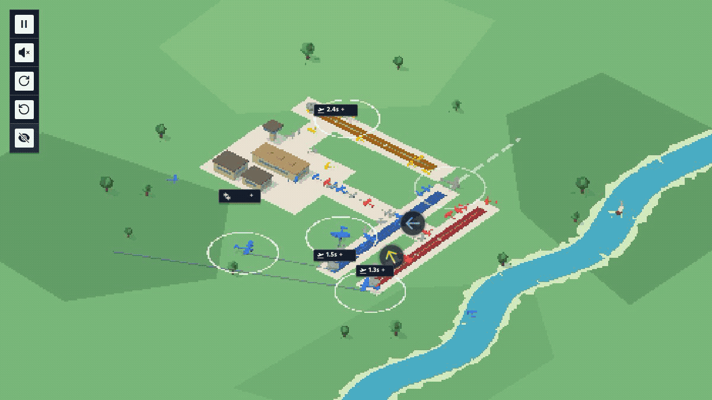

# Holding the sky



The airport looks small: three runways, a few aircraft, one destination per
colour. Draw a line from every plane to its runway and the first minute feels
solved.

Then the sky fills in.

Arrivals cross departures. A safe route becomes unsafe when another aircraft
changes its mind. New planes appear outside the map before they are visible.
The problem is not finding a short path. It is making every path agree with
every other path, sixty times a second, for hours.

This is the controller we built for that.

> The animation is a real accelerated fifteen-minute run against the production game.
> The native scoreboard is hidden; the clock and counters read directly from the
> simulator. The final minutes are rendered from the actual saturated state.

## The tempting path

Each aircraft already knows its runway. Pointing straight at it maximizes
throughput and eventually causes a collision.

Avoiding whatever is close now is not enough either. Two aircraft can be far
apart and still occupy the same point a few seconds later. Once both turn away,
their new paths can create a second conflict that did not exist when either
decision was made.

The controller has to reason in motion.

## The model

For every airborne plane, we test 48 headings around the direct route. Each one
becomes a velocity vector. Against every other aircraft we solve for the time
of closest approach over the next eight seconds:

```text
t* = clamp(−(relative position · relative velocity) / |relative velocity|²)
clearance = |relative position + relative velocity × t*| − both radii
```

The same projection runs against incoming spawn warnings before those aircraft
enter the map. Safe headings score first; forward progress and small turns break
the tie.


One pass would still be selfish: the last plane could invalidate the first
plane's choice. We run four coordination passes, feeding every selected velocity
back into the next decision. The field settles together.

## Commit late

A runway path is sticky. Once assigned, the game owns the landing sequence and
the aircraft has less room to negotiate.

So the controller commits only when the direct heading is clear. Until then it
publishes a long temporary vector and reevaluates on the next frame. The result
looks calm because almost nothing is permanent.

## The last frame

Prediction reduces risk; it does not remove floating-point edges or sequential
updates. After the four planning passes, a final shield projects the exact
positions the 60 Hz simulator will sample next.

If any pair is about to overlap, the threatened aircraft gets one last search
across 64 headings. Only imminent conflicts pay this cost. It is the smallest
part of the controller and the part that catches the rarest failures.

## Making it earn the claim

The visible game is useful for intuition and bad for measurement. We extracted
the production simulation model and built a deterministic evaluator around it:

- five fixed traffic seeds;
- twenty simulated minutes per seed;
- the first five minutes discarded as ramp-up;
- zero score if any seed crashes;
- throughput balanced against the slowest seed and path inflation.

The baseline survived all five runs at `54.534941`. Around it, an isolated
autoresearch process changes only the controller, runs the whole benchmark,
keeps improvements, reverts regressions, and records the next idea. The metric
is not allowed to negotiate with the code.

## Run it

```bash
git clone https://github.com/vreabernardo/airport-solver-runner.git
cd airport-solver-runner
npm install
npm run setup
npm start
```

The browser opens at `552 × 552`, while the simulation keeps the tighter world
bounds discovered during evaluation. Closing the browser or pressing `Ctrl+C`
stops the runner.

For a process that survives the terminal:

```bash
npm run start:background
npm run status
npm run stop
```

The production URL, solver, profile and visible viewport can be replaced without
editing the runner:

```bash
GAME_URL=https://airport.apunen.com/ \
SOLVER_PATH=/absolute/path/to/autopilot.js \
PROFILE_DIR=/tmp/airport-profile \
VIEWPORT_WIDTH=1200 VIEWPORT_HEIGHT=675 \
npm start
```

Regenerate both animations from the real game with:

```bash
npm run capture:hero
npm run capture:decision
```

The capture commands require `ffmpeg` on `PATH` (or its path in `FFMPEG`).

The game is by [@lapunen](https://github.com/lapunen). The runner does not enter
a player name, force game over, or submit a leaderboard score.
